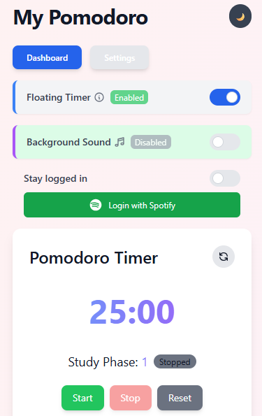
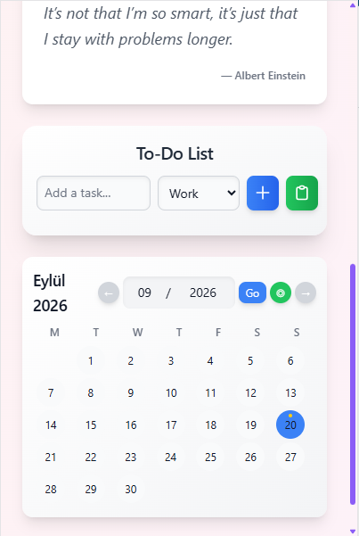

<div align="center">


# Pomovibes

**A relaxing, aesthetic Pomodoro timer with study tracking, to-do lists, and Spotify integration.**


</div>

---

## What is this?

Pomovibes is a browser extension that turns the Pomodoro technique into something you'd actually want to open. It pairs a clean, animated timer with the tools you need to stay in flow — a to-do list, a study calendar, daily motivational quotes, ambient background sound, and a built-in Spotify player — all wrapped in a light/dark themed popup.

## Screenshots

<p align="center">
  
  &nbsp;&nbsp;
  
</p>

## Features

- ⏱️ **Pomodoro Timer** — configurable study, short break, long break durations and cycle count
- 🪟 **Floating Timer** — an on-page overlay that keeps your progress visible while you browse
- 🎵 **Spotify Integration** — log in and control playback without leaving the popup
- 🌙 **Background Sound** — background music, brown noise, or white noise during study sessions
- ✅ **To-Do List** — quick task capture with category tagging
- 📅 **Study Calendar** — track which days you put in the work
- 💬 **Daily Quotes** — a little motivation between sessions
- 🌗 **Light / Dark Mode** — with smooth animated transitions
- 🔔 **Notifications & Alarms** — via Chrome's `notifications` and `alarms` APIs

## Tech Stack

| Layer | Tooling |
|---|---|
| UI | React 18, Tailwind CSS |
| Build | Parcel 2 |
| Platform | Chrome Extension, Manifest V3 |
| Drag & Drop | `@hello-pangea/dnd` |
| Testing | Jest |

## Getting Started

```bash
# install dependencies
npm install

# build the extension
npm run build
```

Then load it into Chrome:

1. Go to `chrome://extensions`
2. Enable **Developer mode**
3. Click **Load unpacked** and select the repo root (or the `dist/` folder, per your `manifest.json` setup)

> Optional: to enable brown noise / white noise, drop your own audio files into `assets/` — see [BACKGROUND_SOUND_README.md](BACKGROUND_SOUND_README.md) for details.

## Project Structure

```
src/
├── components/     # Timer, Settings, Calendar, TodoList, SpotifyPlayer, BackgroundMusic, Quote...
├── content/        # floating timer content script
├── data/           # static data (quotes)
└── styles/         # Tailwind + custom CSS
background.js       # extension service worker
manifest.json       # Manifest V3 config
```

## License

Licensed under the [MIT License](LICENSE).
